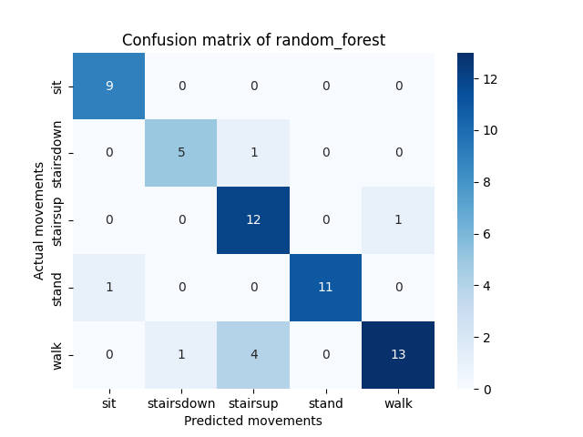
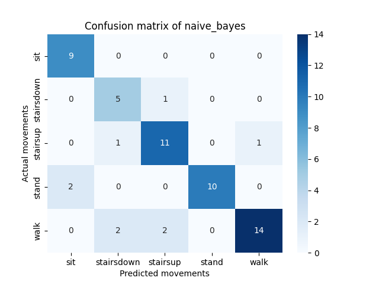
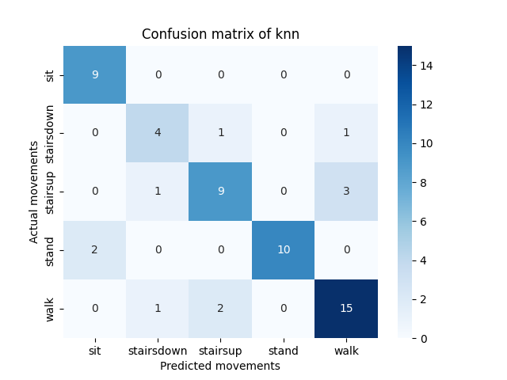
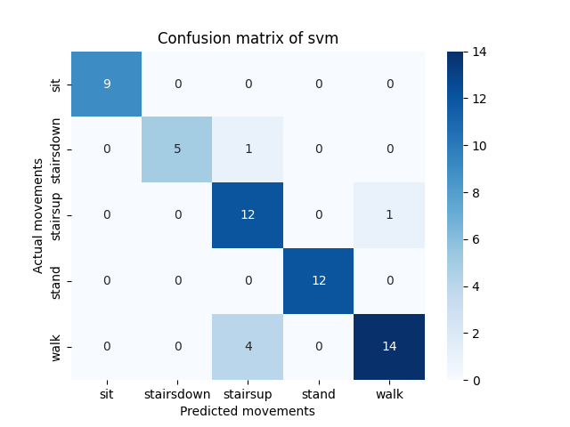
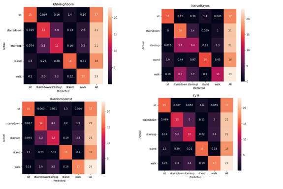

# Dataprocessing movement assessor

This repository contains a functional workflow based on snakemake to train the algorithms random forest, svm, naive 
bayes and K-nearest neighbors on accelerometer data of wearables for the prediction of movements.
This is based on my graduation project, the graduation project can be found at
[link to movement_assessor repository] (https://github.com/dadubber/movement_recognition). The goal of that project was
to create a model that was able to detect basic movements based on the publicly available dataset 
[Heterogeneity activity recognition data set] (https://archive.ics.uci.edu/ml/datasets/Heterogeneity+Activity+Recognition).

#### author: Darius Dubber
#### studentnumber: 341447

## Repository structure
```bash
src
├── __init__.py
├── python_scripts
│   ├── create_confusion_matrix.py
│   ├── feature_extraction.py
│   ├── feature_selection_tools.py
│   ├── __init__.py
│   ├── plot_most_important_features.py
│   ├── prepare_data.py
│   ├── preprocess_data.py
│   ├── __pycache__
│   │   └── feature_selection_tools.cpython-36.pyc
│   ├── validate_algorithm.py
│   └── tune_hyper_parameters.py
├── rules
│   ├── common.smk
│   ├── evaluate_algorithm.smk
│   ├── preprocessing.smk
│   ├── tune_hyper_parameters.smk
│   └── validate_algorithm.smk
├── schemas
│   └── config.schema.yaml
└── Snakefile

```

## Usage
The most important folder can be found in the src folder.
This folder contains the created python scripts, the snakemake rules, the snakefile and the config schema.
<br>
To start the workflow it is first necessarily to create a virtual environment and install all the necessary python 
packages that are given in requirements.txt. This can be done with the commands below:<br>
```bash
pip install virtualenv
virtualenv data_processing
source data_processing/venv/bin/activate
pip install -r requirements.txt
```
If all the packages are installed, the workflow can be started with the command below: <br>
```bash
snakemake --snakefile src/Snakefile -c4
```
The argument -c4 can be changed if there are more threads available. This command will start the Snakefile.
A dag file of the workflow is shown below: <br>

In the dag image you can see that first the training data will be downloaded and preprocessed.
During the preprocessing step the data is segmented in segments of a length of 2 seconds.
The only classes taken in account of the heterogeneity dataset are the movements sit, stand, walk, stairs up and stairs
down.
The workflow follows almost the same steps as in the mentioned project.
The only difference that the data in the workflow is split in a test set of one tenth and a training set. The training
set is used for training and the tuning of the parameters. The tuning of the parameters is performed with GridsearchCV
from the python module sklearn.

## Reports
The benchmark reports can be found in the benchmarks folder.
All the results of the workflow will be stored in the output folder.

## Config
The configurations can be found or changed in the file config/config.yaml.
This file also contains all the parameters used for the classifiers.
The config file can be changed and will also be each time validated with scheme/config.scheme.yaml

## Results
If we compare the results with the non-workflow based approach they look quite similar.
In the graph below you will see for example the found important features for random forest obtained with the workflow.

The graph below shows the obtained 10 most important features for the random forest non workflow based.


You can see that most of the features are similar. The difference can be explained because the non-workflow based used 
cross validation and in the workflow based method the data was splitted in a training and test set.
The workflow-based approach will probably more interesting if the amount of data is improved.

The workflow will also produce besides the calculation of the most important features, the best found parameters for the
classifier, confusion matrices, the jaccard score, f1 score and the accuracy. The best parameters can be found in the
output folder with as name 'best_params_{classifier}'. The confusion matrices can also be found there as 
{classifier}_confusion_matrix.png. The other metrics can be found in the same file {classifier}_results.txt.

If we compare the heatmaps from the workflow with the non-workflow based we can see that the performance of the workflow
is higher. But this is probably a little biased. 

The workflow heatmaps: <br>





The non-workflow based heatmaps:


